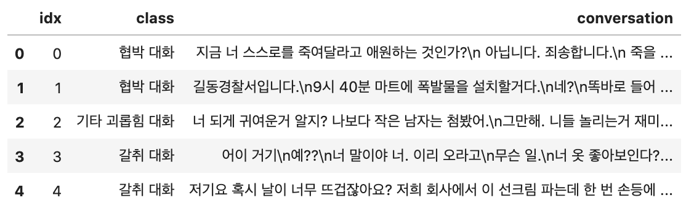
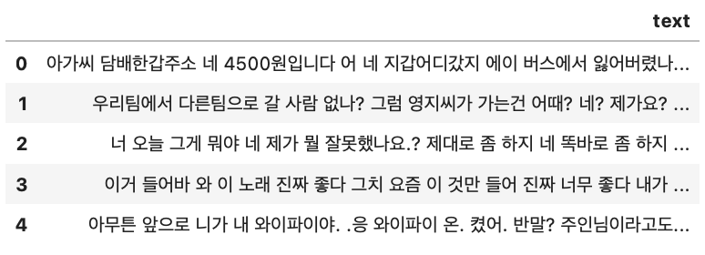

## 1. TUNiB 과제설명 - [DKTC공식 Github](https://github.com/tunib-ai/DKTC)
해당 데이터셋은 TUNiB에서 자체적으로 제작한 데이터인 DKTC(Dataset of Korean Threatening Converstations)으로 classification task 수행합니다. 여기서 주어진 훈련데이터의 클래스는 총4가지('협박', '갈취', '직장 내 괴롭힘', '기타 괴롭힘')이고 테스트데이터는 여기에 '일반 대화'클래스가 하나 추가 되어있습니다.
|Class|Traning|Test|
|:--:|:--:|:--:|
| 협박 대화 | 896 | 100 |
| 갈취 대화 | 981 | 100 |
| 직장 내 괴롭힘 대화 | 979 | 100 |
| 기타 괴롭힘 대화 | 1,094 | 100 |
| 일반 대화 | - | 100 |

훈련데이터에서 빠져있는 '일반 대화'는 [AI Hub](https://aihub.or.kr/?utm_source=google&utm_medium=search&utm_campaign=ga&gclid=CjwKCAjw6raYBhB7EiwABge5KnZuqLSaXjiqfgAETqQwG-_7B2r2e26nDY5cOiNSvrwEUrvIsW9GcRoCRCgQAvD_BwE)에서 내려받아 학습에 활용합니다.

## 2. 데이터 설명
### Train data

- csv파일로 주어져있습니다.
- 각 conversation에 class로 라벨링되어있습니다.
- 대화내용은 '\n'으로 기준으로 나뉘어서 한줄로 이루어져있습니다.
### Test data

- json파일로 주어져있습니다.
- 테스트데이터이므로 라벨은 없고 대화문만 있습니다.
- 훈련데이터와는 달리 대화내용이 '\n'으로 나뉘어져있지 않습니다.

## 3. 프로젝트 환경
- 프로그래밍 언어 : Python3
- 프레임워크 : Tensorflow, Huggingface,
- 작업 환경 : Google Colab, jupyter notebook(GPU : Tesla_t4), GCP(GPU : Tesla_v100)
- 회의록 주소 : https://deep-passive-bf2.notion.site/e204ff1bd98d445e927121eaf36b59ed

## 4. 프로젝트 진행 과정 리더보드
|기간|세부사항|Result|
|:--:|:--:|:--:|
| <베이스라인 설계> 22/11/01 ~ 22/11/09 | 사용모델 : klue bert, klue roberta, KcELECTRA, KeT5  성능측정 : F1 score  기타사항 : 일반대화x, 전처리x|F1 score : 0.88 ~ 0.94|
| <Labeling 작업>  22/11/10 ~ 22/11/13 | Train Data를 다양한 방식으로 input하기위해 추가적 라벨링을 진행 | 1 : 가해자   2 : 피해자 |
| < EDA >  22/11/14 ~ 22/11/ | 

## 5. Reference
모델 선택
- Transformer
  - [한국어 사전학습 모델 (Korean Pre-trained Language Model)](https://sooftware.io/korean-plm/)
- RNN
  - LSTM
  - BiLSTM

데이터 수집
- [AI hub](https://aihub.or.kr/?utm_source=google&utm_medium=search&utm_campaign=ga&gclid=CjwKCAjw6raYBhB7EiwABge5KnZuqLSaXjiqfgAETqQwG-_7B2r2e26nDY5cOiNSvrwEUrvIsW9GcRoCRCgQAvD_BwE)
- [용도별 목적대화 데이터](https://aihub.or.kr/aihubdata/data/view.do?currMenu=115&topMenu=100)
- [주제별 텍스트 일상 대화 데이터](https://aihub.or.kr/aihubdata/data/view.do?currMenu=115&topMenu=100)

전처리
- [한국어 전처리 패키지](https://wikidocs.net/92961)
- [KorEDA](https://github.com/catSirup/KorEDA/tree/master)

EDA
- [자연어처리_키워드추출](https://soyoung-new-challenge.tistory.com/45)
